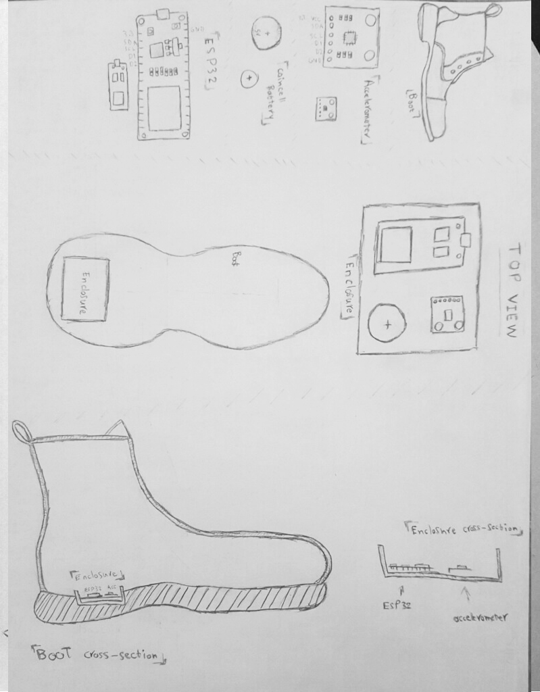

# Disruptive Dress

An interactive dress which provokes the wearer to move and engage the bystanders through passive and active motions. Specifically, it will “disrupt” the wearer, if they remain inactive for too long, through self animation, as signal the wearer of their sourroundings through passive sensors.

Objective
---
The goal of this project is to explore movement as input and output in interactive wearables; Through motors, passive sensors, and other such wearable electronics.

Inspiration
---

Storyboard
---

Orthographic Drawings
---
#### Drawing #1:

- The dress, with the feather kinetic collar, showing how the feathers on the collar will flip up and down in response to input from the muscle sensors.
- Dress also has embedded sonar sensor in the front, and vibration motors in the back.
- The dress has an overskirt that attaches at the belt. The overskirt has servos that pull on elastic strings, shifting the fabric. The overskirt also has shape changing wires that lift up fabric in the skirt.

#### Drawing #2:

- Shoes that contain the accelerometer that will serve as input to controlling the kinetic overskirt.

Wearable technologies we explored
---

- Memory wire: Wire that can remember its shape and self-bend to its original shape when subjected to heat.
- Vibro motor: Motor that vibrates
- Servo: Motor with limited range of rotation (typically 180deg) but with precise angular and speed control.
- Sonar Sensor: Sensor that detects objects using soundwaves.
- Muscle Tension Sensor: Sensor that senses tension in muscles
- Accelerometer: Sensor that measures acceleration or changes in velocity in a specific direction. It can be used to detect changes in motion, orientation, and vibration.
- Thermistor: Temperator sensor that changes its resistance with changes in temperature.
- Bluetooth module: Module that can be connected to a microcontroller to enable wireless communication through bluetooth technology.
- Microcontroller: Small computer on a single integrated chip. Used for controlling and monitoring electronic devices in small scale settings such as  IOT, robotics, medical devices, wearable technologies, etc...

Extension:
---

We plan on continuing this project by making an interactive shoe, time permitting.

Demo:
---
So far we have finished a prototype of a part of the dress as seen below

Tools
---

- Dual Extruder 3D Printer
- Form Resin Printer
- Laser Cutter
- Sewing Machine

Project Members
---

Adele:
- Electronics
- 3D modeling and design 
- Programming
- Code documentation
- Coffee Boy

Trisha: 
- Dress Design
- Sewing 
- Kinetic feedback 
- Materials
- 3D modeling and design
- Project documentation & writing

Links:
---

[Slide Deck](https://docs.google.com/presentation/d/1ZVLHiuInIdvwnq_INGBzH2avjaGatzArUWuavUCW_DY/edit?usp=sharing)

[Project Proposal](https://www.google.com)

---
#### Sources

###### 1. Berzowska, Joanna, and Marcelo Coelho. "Kukkia and vilkas: Kinetic electronic garments." Ninth IEEE International Symposium on Wearable Computers (ISWC'05). IEEE, 2005.
###### 2. Hartman, Kate, Boris Kourtoukov, and Erin Lewis. "Kinetic Body Extensions for Social Interactions." Proceedings of the Twelfth International Conference on Tangible, Embedded, and Embodied Interaction. ACM, 2018.
###### 3. Tomico, Oscar, et al. "Towards a next wave of wearable and fashionable interactions." International Journal of Design 11.3 (2017): 1-6.
###### 4. Tomico, Oscar, and Danielle Wilde. "Soft, embodied, situated & connected: enriching interactions with soft wearables." mUX: The Journal of Mobile User Experience 5.1 (2016): 3.
###### 5. Nagel, Saskia K., et al. "Beyond sensory substitution—learning the sixth sense." Journal of neural engineering 2.4 (2005): R13.
###### 6. Moen, Jin. KinAesthetic movement interaction: designing for the pleasure of motion. Diss. KTH Royal Institute of Technology, 2006.
###### 7. ten Bhömer, Martijn, Eunjeong Jeon, and Kristi Kuusk. "Vibe-ing: Designing a smart textile care tool for the treatment of osteoporosis." Proceedings of the 8th International Conference on Design and Semantics of Form and Movement. 2013. https://www.mtbhomer.com/portfolio/vibe-ing/ 
###### 8. Marie O'Mahoney, Kate Hartman, Lorette Faveri. “SoMo: Sound and Movement”. 2012. https://www2.ocadu.ca/research/socialbody/project/sound- and-movement-somo
###### 9. Svanaes, D. and M. Solheim. Wag your tail and flap your ears: The kinesthetic user experience of extending your body. in Proceedings of the 2016 CHI Conference Extended Abstracts on Human Factors in Computing Systems. 2016. ACM.
###### 10. Höök, Kristina, et al. "Somaesthetic appreciation design." Proceedings of the 2016 CHI Conference on Human Factors in Computing Systems. ACM, 2016.
###### 11. Dierk, Christine, et al. "HäirIÖ: Human hair as interactive material." Proceedings of the Twelfth International Conference on Tangible, Embedded, and Embodied Interaction. ACM, 2018.
###### 12. Moen, Jin, and Johan Sandsjö. "BodyBug–Design of KinAesthetic Interaction." Nordes 1 (2009).
###### 13. Hartman, Kate, et al. "Monarch: Self-expression through wearable kinetic textiles." (2015): 413-414.
###### 14. Lah, Alenka Šalej, et al. "Preparation of Shape Memory NiTiNOL Filaments for Smart Textiles." Tekstilec 59.2 (2016).
###### 15. Kao, Hsin-Liu Cindy, et al. "Exploring interactions and perceptions of kinetic wearables." Proceedings of the 2017 Conference on Designing Interactive Systems. ACM, 2017.
###### 16. Ma, Nini, et al. "Application of shape memory materials in protective clothing: a review." The Journal of The Textile Institute (2018): 1-9.
###### 17. Thecla Schiphorst. 2009. Soft(n): Toward a Somaesthetics of Touch. In CHI ’09 Extended Abstracts on Human Factors in Computing Systems. ACM, 2427–2438. https://doi.org/10.1145/1520340.1520345

